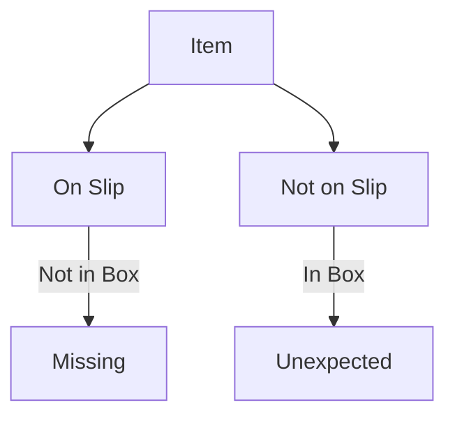

# Shipment

## Goals 
- Identify Missing Items
- Identify Unexpected Items 

## Missing Items
Items that **ARE** listed on the packing slip but **ARE NOT** included in the shipmnet.
If there is a missing item, it can be notated on the removal sheet.

## Unexpected Items
Items that **ARE NOT** listed on the packing slip but **ARE** inluded in the shipment.
if there is a missing item, it can be notated on the removal sheet.

