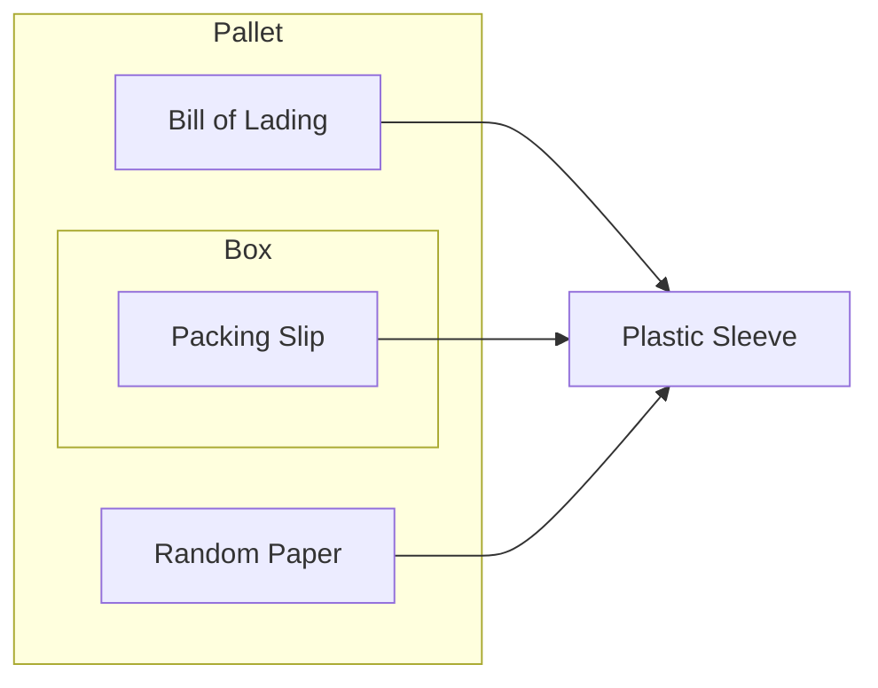

# Secure

## Goals:
- Secure the physical documents with a plastic sleeve
- When opening a box, avoid cutting through the shipping label

## Physical Documents

## Packing Slip
All returns are expected to be delivered with a packing slip. The slip
lists all of items that are within the container. Unfortunately, packing slips 
are small pieces of paper that can be lost or destroyed. 

### Common Hiding Spots
- Beneath internal box flaps
- Slipped into items
- Taped / stuck on shipping box
- Taped / stuck on items

## Bill of Lading & Random Paper
Pallet returns are expected to be delivered with a bill of lading. A bill of 
lading will show the carrier, the tracking (or PRO number), and removal order 
information. Per checking-in, **all** bills of lading should have already been placed 
into a plastic sleeve on arrival.
